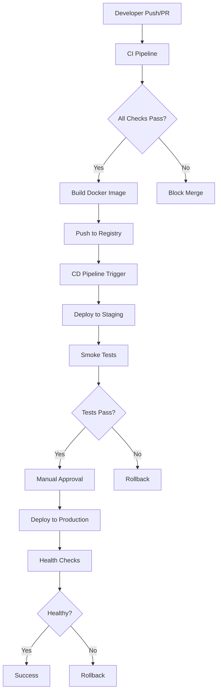

# CI/CD Pipeline Documentation

## Overview

This document describes the comprehensive CI/CD pipeline implemented for the Social Chat Backend project. The pipeline follows industry best practices for continuous integration, security, testing, and deployment automation.

## 🏗️ Architecture Overview



## 📋 Pipeline Components

### 1. Continuous Integration (CI)

**File:** `.github/workflows/ci.yml`

The CI pipeline runs on every pull request and push to main branch, performing comprehensive quality checks:

#### Jobs:

1. **Code Quality** 🔍

    - ESLint analysis with SARIF output
    - Prettier formatting validation
    - TypeScript type checking
    - Code quality metrics

2. **Security Scanning** 🔒

    - Dependency vulnerability scanning (npm audit)
    - CodeQL static analysis
    - Security best practices validation

3. **Unit Tests** 🧪

    - Jest unit test execution
    - Code coverage reporting
    - Codecov integration

4. **Integration Tests** 🔗

    - End-to-end testing with PostgreSQL and Redis
    - Service integration validation
    - API endpoint testing

5. **Build & Docker** 🏗️

    - Application build verification
    - Docker image creation and optimization
    - Container security scanning (Trivy)
    - Multi-platform builds (linux/amd64)

6. **Deployment Readiness** 🚀
    - Final validation checks
    - Deployment approval signal

#### Triggers:

- Pull requests to `main` or `develop`
- Pushes to `main` branch
- Manual workflow dispatch

### 2. Continuous Deployment (CD)

**File:** `.github/workflows/cd.yml`

The CD pipeline handles automated deployment to staging and production environments:

#### Jobs:

1. **Prepare Deployment** 📋

    - Environment determination (staging/production)
    - Image tag resolution
    - Deployment plan generation

2. **Deploy to Staging** 🔄

    - Automated staging deployment
    - Health check validation
    - Smoke test execution
    - Environment verification

3. **Production Approval** 🎯

    - Manual approval gate for production
    - Staging validation summary
    - 24-hour timeout for approval

4. **Deploy to Production** 🏭

    - Blue-green deployment strategy
    - Pre-deployment backup
    - Health check validation
    - Post-deployment monitoring

5. **Notifications** 📢
    - Deployment status notifications
    - Summary reporting
    - Alert management

#### Triggers:

- Pushes to `main` branch (auto-staging)
- Manual workflow dispatch (staging/production)
- Successful CI completion

### 3. Release Management

**File:** `.github/workflows/release.yml`

Automated semantic versioning and release creation:

#### Features:

- Conventional commit analysis
- Semantic version calculation
- Automated changelog generation
- GitHub release creation
- Tagged Docker image builds
- Production deployment triggering

#### Triggers:

- Pushes to `main` with release-worthy changes
- Manual release workflow dispatch

## 🐳 Docker Configuration

### Multi-stage Dockerfile

**File:** `Dockerfile`

- **Builder stage:** Installs dependencies and builds application
- **Production stage:** Optimized runtime image with security hardening
- **Security features:**
    - Non-root user execution
    - Health check integration
    - Minimal attack surface

### Environment Configurations

#### Development

**File:** `docker-compose.yml`

- Local development environment
- All services included
- Development optimizations

#### Staging

**File:** `docker-compose.staging.yml`

- Staging environment configuration
- Resource limits and constraints
- Health check configurations
- Different ports to avoid conflicts

#### Production

**File:** `docker-compose.production.yml`

- Production-ready configuration
- Security hardening
- Resource optimization
- Nginx reverse proxy
- Log aggregation (Fluent Bit)
- Performance tuning

## 🛠️ Scripts and Utilities

### Health Check Script

**File:** `scripts/health-check.js`

- Comprehensive application health validation
- Database connectivity verification
- External service dependency checks
- Configurable timeout and retry logic

### Deployment Script

**File:** `scripts/deploy.sh`

- Environment setup and validation
- Database migration handling
- Blue-green deployment support
- Rollback capabilities
- Health check integration

## 🔧 Configuration Files

### Package.json Scripts

```json
{
    "scripts": {
        "lint": "eslint \"{src,apps,libs,test}/**/*.ts\"",
        "lint:fix": "eslint \"{src,apps,libs,test}/**/*.ts\" --fix",
        "prettier": "prettier --write \"src/**/*.ts\" \"test/**/*.ts\"",
        "prettier:check": "prettier --check \"src/**/*.ts\" \"test/**/*.ts\"",
        "docker:build": "docker build -t social-chat-backend .",
        "docker:staging": "docker-compose -f docker-compose.staging.yml up -d",
        "docker:prod": "docker-compose -f docker-compose.production.yml up -d"
    }
}
```

### Docker Ignore

**File:** `.dockerignore`

Optimized to exclude unnecessary files from Docker build context, reducing image size and build time.

## 🔐 Security Features

### CI/CD Security

- Secret management through GitHub Secrets
- Container image vulnerability scanning
- SAST (Static Application Security Testing)
- Dependency vulnerability monitoring
- Non-root container execution

### Environment Security

- Environment-specific configurations
- Secure credential handling
- Network isolation
- Resource constraints
- Security-hardened containers

## 📊 Monitoring and Observability

### Health Checks

- Application-level health endpoints
- Database connectivity monitoring
- External service dependency validation
- Performance metrics collection

### Logging

- Structured logging with Pino
- Log aggregation with Fluent Bit
- Centralized log management
- Error tracking and alerting

## 🚀 Deployment Strategies

### Blue-Green Deployment

- Zero-downtime deployments
- Instant rollback capability
- Production traffic switching
- Health validation before traffic switch

### Rollback Strategy

- Automated rollback on health check failure
- Manual rollback capability
- Previous version preservation
- Database backup integration

## 📈 Performance Optimizations

### Docker Optimizations

- Multi-stage builds for smaller images
- Layer caching for faster builds
- Dependency optimization
- Build context minimization

### CI/CD Optimizations

- Parallel job execution
- Intelligent caching strategies
- Conditional workflow execution
- Resource usage optimization

## 🔄 Workflow Triggers

### Automatic Triggers

- Pull request creation/updates
- Push to main branch
- Release-worthy commit detection
- Health check failures

### Manual Triggers

- Manual deployment to specific environments
- Emergency rollbacks
- Release creation
- Pipeline re-runs

## 📝 Environment Variables

### CI Environment Variables

```bash
NODE_VERSION=22.16.0
REGISTRY=ghcr.io
IMAGE_NAME=${{ github.repository }}
```

### Deployment Environment Variables

#### Staging

- `STAGING_DATABASE_URL`
- `STAGING_REDIS_URL`
- `STAGING_JWT_SECRET`

#### Production

- `PRODUCTION_DATABASE_URL`
- `PRODUCTION_REDIS_URL`
- `PRODUCTION_JWT_SECRET`
- `DOCKER_REGISTRY`
- `DATA_PATH`

## 🛡️ Security Best Practices

### Secrets Management

- All sensitive data stored in GitHub Secrets
- Environment-specific secret separation
- Regular secret rotation policies
- Audit trail for secret access

### Container Security

- Non-root user execution
- Minimal base images
- Regular security scanning
- Security policy enforcement

### Access Control

- Branch protection rules
- Required status checks
- Manual approval gates
- Role-based access control

## 📋 Maintenance and Updates

### Regular Updates

- Dependency updates via Dependabot
- Base image updates
- Security patch management
- Tool version updates

### Monitoring and Alerts

- Pipeline failure notifications
- Security vulnerability alerts
- Performance degradation monitoring
- Resource usage tracking

## 🚀 Getting Started

### Prerequisites

1. GitHub repository with appropriate permissions
2. Container registry access (GitHub Container Registry)
3. Target deployment environments configured
4. Required secrets configured in GitHub

### Setup Steps

1. Configure GitHub Secrets for all environments
2. Set up staging and production infrastructure
3. Configure deployment target credentials
4. Enable GitHub Actions in repository
5. Test pipeline with a sample deployment

### Required GitHub Secrets

#### General

- `GITHUB_TOKEN` (automatically provided)

#### Staging Environment

- `STAGING_DATABASE_URL`
- `STAGING_REDIS_URL`
- `STAGING_JWT_SECRET`

#### Production Environment

- `PRODUCTION_DATABASE_URL`
- `PRODUCTION_REDIS_URL`
- `PRODUCTION_JWT_SECRET`
- `POSTGRES_USER`
- `POSTGRES_PASSWORD`
- `POSTGRES_DB`
- `REDIS_PASSWORD`
- `RABBITMQ_USER`
- `RABBITMQ_PASSWORD`
- `MINIO_ACCESS_KEY`
- `MINIO_SECRET_KEY`

## 🔍 Troubleshooting

### Common Issues

#### CI Pipeline Failures

- Check ESLint configuration
- Verify test database connectivity
- Review dependency conflicts
- Validate Docker build context

#### Deployment Failures

- Verify environment variables
- Check service health endpoints
- Review resource constraints
- Validate network connectivity

#### Health Check Failures

- Check application startup time
- Verify database migrations
- Review service dependencies
- Validate configuration files

### Debug Commands

```bash
# Test health check locally
node scripts/health-check.js

# Test deployment script
./scripts/deploy.sh -e staging -i latest --help

# Build Docker image locally
docker build -t social-chat-backend .

# Test staging environment
docker-compose -f docker-compose.staging.yml up
```

## 📞 Support and Contact

For issues related to the CI/CD pipeline:

1. Check the GitHub Actions logs
2. Review this documentation
3. Create an issue in the repository
4. Contact the DevOps team

## 📚 Additional Resources

- [GitHub Actions Documentation](https://docs.github.com/en/actions)
- [Docker Best Practices](https://docs.docker.com/develop/dev-best-practices/)
- [NestJS Deployment Guide](https://docs.nestjs.com/techniques/performance)
- [Container Security Guide](https://sysdig.com/blog/dockerfile-best-practices/)

---

**Last Updated:** $(date +"%Y-%m-%d")
**Version:** 1.0.0
**Maintained by:** DevOps Team
