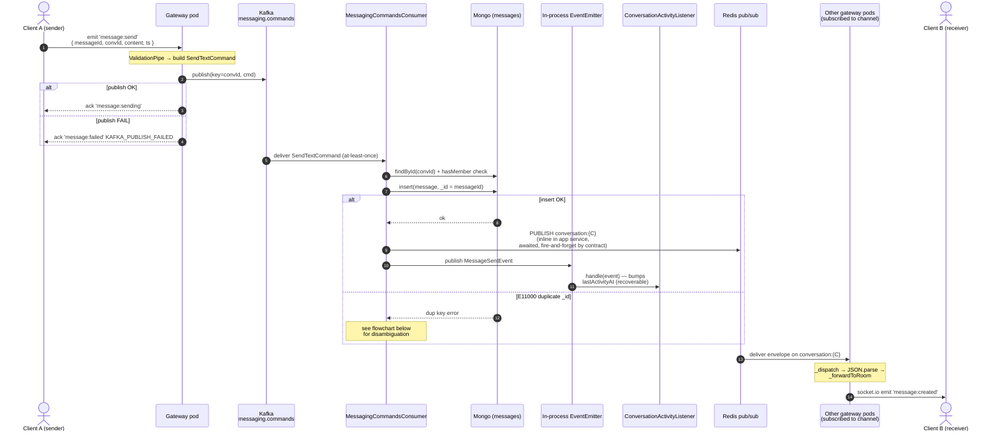
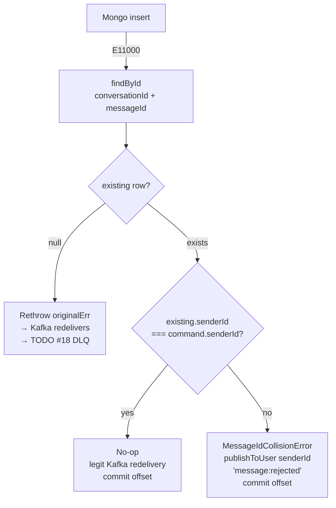
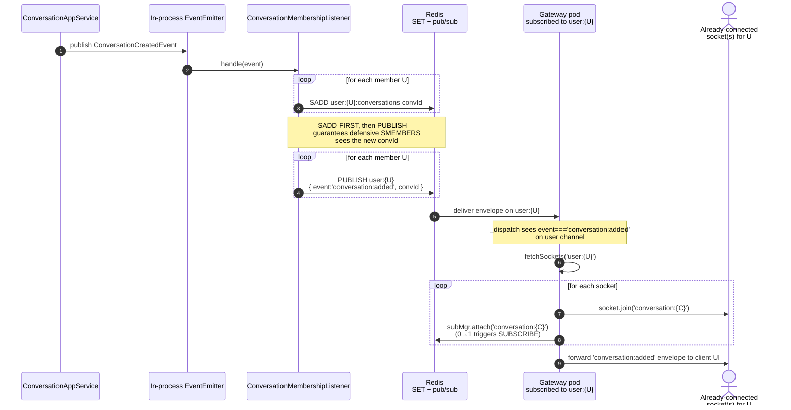
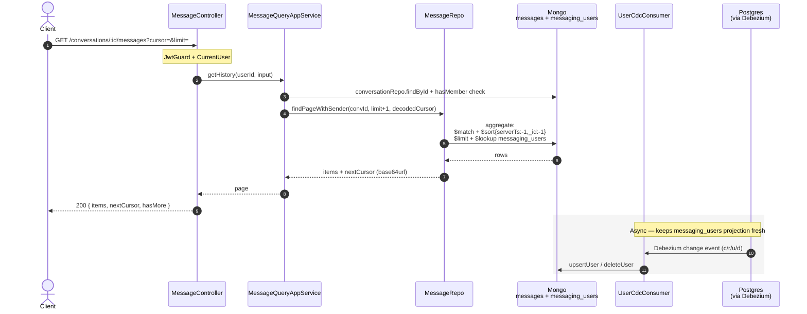

# Messaging Pipeline — Send / Read Walkthrough + Failure Modes

> Status: snapshot as of 2026-05-23, covering everything implemented through
> Stories 6.1 → 6.4. Story 6.4-B Mongo notifications was **rejected** in
> favor of layered fallbacks (history fetch + client-side timeout + DLQ on
> the consumer side). The `KafkaIntegrationConsumer` base class now runs
> bounded transient retry + dead-letter-queue routing per `messaging.commands.dlq`.
>
> Scope: end-to-end path of a single message, from `client.emit('message:send')`
> through to recipient sockets, plus the history read path that the same
> message is later served from. Every hop is annotated with what can break,
> what gets retried, what collides, and what is silently lost when infra or
> network drops.

---

## 1. Components in play

| Process | Responsibility |
|---|---|
| `apps/realtime-gateway` | Terminates WebSockets, verifies JWT via Keycloak, publishes `SendTextCommand` to Kafka, subscribes to Redis pub/sub channels `user:{U}` and `conversation:{C}` and forwards inbound envelopes to socket.io rooms. Pod-local socket.io rooms — no Redis adapter. |
| `apps/messaging` | Consumes `messaging.commands`, runs application services (conversation membership check, message entity creation, Mongo insert with idempotent `_id`), emits in-process domain events, publishes WS push envelopes to Redis, serves history via HTTP, runs a CDC consumer that keeps a local `messaging_users` projection in sync from Postgres. |
| Kafka | Transports `messaging.commands` (key = `conversationId`, per-conversation FIFO) and Debezium CDC topics for users. |
| Mongo | Source of truth for conversations + messages. `_id` of messages = client-supplied UUIDv7 (idempotency anchor). |
| Redis | (a) Pub/sub for cross-pod WS fan-out; (b) `user:{U}:conversations` SET — per-user membership cache that gateway uses on connect. |
| Postgres | Source of truth for users; replicated to Mongo `messaging_users` via Debezium → CDC consumer. |

Key design choice: **no socket.io Redis adapter.** Cross-pod routing is done
by Redis pub/sub at the application layer; socket.io rooms are pod-local.

---

## 2. SEND PATH — sequence diagram

### 2.1. Duplicate-key disambiguation (E11000 branch)

---

## 3. SIDE PATH — membership cache + mid-session "new conversation"

Symmetric path on `conversation:removed` issues `socket.leave` +
`subMgr.detach` for each socket.

---

## 4. READ PATH (history) + CDC sync

---

## 5. Failure-mode table — every hop, every nasty thing

| # | Hop | Failure / race | What the system does today | What stays broken |
|---|---|---|---|---|
| 1 | TCP / WS handshake | Pod dies, NAT drop, app suspend | Socket.io engine.io heartbeats detect, client auto-reconnects | Frames in-flight at moment of drop are lost; recipient gap until reconnect + history fetch |
| 1 | KC verifyToken | Keycloak unreachable | `next(Error('Unauthorized: invalid token'))` → connect refused | All new conns until KC recovers; existing conns unaffected (no re-verify) |
| 1 | Token revoked mid-session | — | Not re-verified; user stays connected with stale rights | Authorization drift until disconnect |
| 2 | Gateway → Kafka publish | Broker down / ISR shrink / topic missing | Returns `message:failed KAFKA_PUBLISH_FAILED`; client must retry **same** messageId | If client retry budget exhausted, message lost (never persisted) |
| 2 | Producer hang | Kafka slow, request queue full | No explicit timeout in this code — caller awaits `kafkaProducer.publish`; socket ack stays pending | Client must enforce its own ack timeout / retry |
| 2 | Per-conversation ordering | Partition reassignment / different producer | Key = convId → same partition. Order preserved unless multiple producer instances send to same partition with `acks=1` and in-flight > 1 | Theoretical reordering inside a partition during in-flight retries |
| 3 | Kafka delivery to consumer | At-least-once | Same envelope can be delivered ≥2× (consumer crash before commit) | Handled by E11000 same-sender no-op — exactly-once **effect** |
| 3 | Consumer crash mid-handle | Pod dies between insert + offset commit | Partition reassigned; redelivery → E11000 → no-op | None — clean recovery |
| 3 | Rebalance / long handler | handler > `max.poll.interval.ms` | Consumer kicked → loop | Stalls partition (one convId family of conversations) — needs monitoring |
| 4 | Mongo insert network drop | Mongo unreachable | Non-E11000 error → bubbles to `KafkaIntegrationConsumer.processMessage` → `classifyError` returns `transient` → in-handler retry 3× with 1s/2s/4s backoff → if still failing, DLQ as `transient-exhausted` + `message:rejected:internal` to sender via `onDeadLettered` | Bounded retry window (~7s worst case). Poison partition cannot stall — exhausted message goes to `messaging.commands.dlq`. |
| 4 | Duplicate key — different sender | UUIDv7 collision OR malicious replay | `_handleDuplicateKey` wraps `MessageIdCollisionError` in `PermanentError` → base writes DLQ → `onDeadLettered` publishes `message:rejected:collision` to sender via Redis | Offset committed; permanent rejection (correct behavior). `dlqContext` carries attemptedSenderId + existingSenderId for ops inspection. |
| 4 | Duplicate key — but findById returns null | Colliding row in another conversation (our findById scopes by convId) OR read-after-write lag | Bubble raw → base treats as transient → 3× retry → if still null, DLQ as `transient-exhausted` + `message:rejected:internal` | Bounded — never an infinite loop. The transient-vs-permanent guess can be wrong here (could be cross-conversation collision = truly permanent), so the DLQ entry is the audit trail. |
| 4 | Clock skew | Server clock jump | `serverTs = clock.now()` is server-authoritative; cursor pagination depends on it | Out-of-order timestamps possible if clocks skew across messaging-app replicas — affects history sort within same ms |
| 5 | Domain event publish | Listener throws | `publishAll` await rejects → bubbles through app service to consumer → classified `transient` → bounded retry → if still failing, DLQ + client timeout fires | Message persisted but no real-time push → recipients see it on next history fetch. Sender sees a timeout (no `message:created` echo) and treats it as ambiguous — UI offers retry with fresh messageId. |
| 5 | Crash between Mongo insert and EventEmitter.emit | Pod dies right after `await messageRepo.insert` | Kafka redelivers → E11000 same-sender no-op → BUT `MessageSentEvent` is **never re-emitted** | **Silent gap**: message persisted, real-time push lost. **Safety net = client-side timeout on sender**: no `message:created` echo within ~30s → UI flips to "send failed (unknown)". Recipient discovers on next history fetch. (Decision 2026-05-23: Mongo notifications collection rejected in favor of timeout.) |
| 6 | Redis PUBLISH fail | Redis down / failover / network partition | `catch → logger.error`, swallowed (fire-and-forget contract) | Real-time push lost; persisted message visible on history fetch only |
| 6 | Hot conversation fan-out | Very large group | Single PUBLISH; each pod with ≥1 member subscribed gets one copy + emits locally | Linear in #pods that hold ≥1 member; could saturate Redis if #pods × msg-rate is huge |
| 7 | Redis pub/sub gap | At-most-once. Subscriber disconnect / failover | ioredis auto-reconnects + auto-resubscribes, but **messages during the gap are lost** | Code comment in `RedisSubscriptionManager` explicitly accepts this. Safety net for `message:created` = recipient history fetch on reconnect. Safety net for `message:rejected` = client-side timeout on sender. |
| 7 | attach() race window | PUBLISH lands between `attach()` call and SUBSCRIBE confirming on Redis | Documented & accepted in code comment | Same loss paths; same safety nets. |
| 7 | Subscriber pod restart | Counts map in-memory only | Reset to empty; new connections rebuild attaches | Anything in flight at restart is dropped (same as above) |
| 8 | _dispatch JSON.parse | Malformed publisher | warn + return | One message dropped on that pod only |
| 8 | Socket.io room emit | Pod local only (intentional — no socket.io Redis adapter) | Each pod emits to its own sockets; cross-pod handled by Redis pub/sub | If recipient is on a pod that is NOT subscribed to the channel (cache miss / stale `user:{U}:conversations`), the pod misses entirely |
| 9 | Socket send-buffer full | Very slow client | Default socket.io buffers in memory until disconnect | Slow consumer can OOM the pod — no `maxHttpBufferSize` / backpressure tuning visible |
| 9 | Client offline at emit time | Socket disconnected | Frame discarded | History fetch on reconnect for `message:created`; client-timeout fallback for `message:rejected` (sender treats as ambiguous). `conversation:added` is recovered via `GET /conversations` (story 6.9, not yet shipped). |
| R1 | Membership cache: SADD vs PUBLISH | `ConversationMembershipListener` is **not transactional** — Mongo conv insert / SADD / Redis PUBLISH are 3 independent steps | Order is intentional: SADD first, PUBLISH second. But the conversation **Mongo write itself happened first and is not undone if SADD fails** | A: Mongo conv exists but SADD failed → next connect's SMEMBERS misses convId → user never subscribes → silent real-time blackout for that convo until re-SADD. B: SADD ok, PUBLISH fail → already-connected sockets won't auto-join until reconnect; SMEMBERS on reconnect heals |
| R2 | `_handleConversationAdded` racing connect | conversation:added arrives during `handleConnection` — between `subMgr.attach('user:{U}')` completing and `SMEMBERS` returning | The socket has been `.join('user:{U}')`-ed already, so `fetchSockets('user:{U}')` will pick it up — but if the user's pod hadn't yet finished `attach('user:{U}')`, the event was published into the void on this pod | Window is small; defended by joining user-room BEFORE issuing SMEMBERS. Subscribed *attached* set keeps disconnect symmetric |
| R3 | `attachedChannels` Set | Why it exists | Disconnect detaches exactly what THIS socket attached — protects against SMEMBERS having raced a mid-session membership change | Defensive — see `realtime.gateway.ts` lines 106-114 |
| R4 | CDC lag for sender info | New user → message arrives before Debezium ships them to messaging_users | `$lookup` returns null sender; mapper sets `sender: null` | UI must tolerate null sender briefly; resolves on next page fetch after lag clears |

---

## 6. Recovery contract — what catches each "silent loss"

The three architectural gaps:

1. **Mongo write succeeds, EventEmitter never fires** (process crash in the
   microsecond gap). Kafka redelivery hits E11000 same-sender → no-op → push
   never fires. **Recovery**: recipient pulls history on reconnect; sender's
   client-side timeout flips the spinner to "send failed (unknown)" — UI
   offers a retry as a *new* message (fresh messageId).
2. **Redis publish or subscribe gap.** Fire-and-forget at every layer.
   **Recovery**: same as #1 — recipient history fetch + sender timeout.
3. **Stale `user:{U}:conversations` SET.** If SADD failed once and was never
   repaired, that user will never subscribe to that conversation on future
   connects. There's no reconciliation/repair job (yet). **Recovery**: only
   the next conversation-touching write (e.g. another member is added) would
   trigger a re-SADD. Until then, that user has a silent blackout for that
   conversation's real-time stream. Story 6.9 (`GET /conversations`) will at
   least surface that the conversation exists on inbox-list refresh.

**Why no durable per-recipient outbox.** Decision 2026-05-23: a Mongo
`notifications` collection was rejected in favor of layered fallbacks
(history fetch + client-side timeout + DLQ for the consumer side). Trade-off:
sender learns of rejection within timeout-window (~30s) instead of
~10ms-via-Redis on the happy path; recipient must actively fetch history to
see late messages. Acceptable for current scale; revisit if Epic 8
(notifications) requires a durable feed anyway.

**The DLQ is the per-message audit trail.** A message that fails permanently
or exhausts transient retries lands in `messaging.commands.dlq` with full
context (original payload, error class+message, retry count, dlqContext from
`PermanentError`). Ops can drain or replay manually.

---

## 7. Code-path reference index

Send path:
- `apps/realtime-gateway/src/driving-adapters/gateways/realtime.gateway.ts`
  — `afterInit` (auth middleware), `handleConnection`, `handleSendMessage`,
  `_dispatch`, `_forwardToRoom`, `_handleConversationAdded/Removed`.
- `apps/realtime-gateway/src/driven-adapters/redis-subscription-manager.ts`
  — per-pod ref-counted SUBSCRIBE/UNSUBSCRIBE, accepts the attach() race
  window in its class comment.
- `apps/realtime-gateway/src/driven-adapters/redis-user-conversations-cache.adapter.ts`
  — SMEMBERS reader for the per-user membership cache.
- `packages/common/integration-events/messaging/send-message.command.ts`
  — wire format on `messaging.commands`. Carries text + optional
  attachmentKeys (story 6.5).

Messaging app:
- `apps/messaging/src/driving-adapters/consumers/messaging-commands.consumer.ts`
  — at-least-once Kafka → idempotent insert. Houses
  `MessageIdCollisionError`, the duplicate-key disambiguation, and the
  `onDeadLettered` hook that publishes `message:rejected` to the sender
  for both permanent errors and `transient-exhausted` retries.
- `packages/infrastructure/messaging/kafka/consumers/kafka-integration-consumer.ts`
  — Base class: parse → handle → classify error → retry transient (3× with
  1s/2s/4s backoff) → DLQ permanent + exhausted → `onDeadLettered` hook.
  `processMessage` never throws; the offset is always committed so poison
  messages cannot stall a partition.
- `packages/infrastructure/messaging/kafka/errors/permanent-error.ts`
  — Thrown by subclass to mark an error permanent and attach structured
  `dlqContext`. Counterpart: `classifyError()` hook for type-based rules.
- `packages/infrastructure/messaging/kafka/dlq/dlq-record.ts`
  — Schema for DLQ records (originalEvent, originalTopic/partition/offset,
  classification, retryCount, error snapshot, dlqContext).
- `apps/messaging/src/application/services/message.application-service.ts`
  — membership check + Mongo insert + **inline** WS push (`_pushWsEvent` →
  `publishToConversation`) + domain event publish. Push is awaited so the
  consumer sees publish failures; the publisher itself swallows the error
  per the fire-and-forget contract. Intentionally NOT a listener: the WS
  push attempt is part of the same logical unit as the Mongo write, so the
  consumer can ack/retry coherently. Listener pattern is reserved for
  recoverable side-effects (e.g. `ConversationActivityListener` updating
  `lastActivityAt`).
- `apps/messaging/src/driven-adapters/ws-push/redis-ws-push-publisher.adapter.ts`
  — fire-and-forget contract; swallows errors with a log.
- `apps/messaging/src/application/listeners/conversation-membership.listener.ts`
  — non-transactional 3-step (Mongo insert already done, then SADD, then
  PUBLISH) — source of failure R1.

Read path:
- `apps/messaging/src/driving-adapters/controllers/message.controller.ts`
  — `GET /conversations/:id/messages`.
- `apps/messaging/src/application/services/message-query.application-service.ts`
  — membership check + paginated read.
- `apps/messaging/src/driven-adapters/repos/message-repository.adapter.ts`
  — cursor encode/decode + `$lookup` to `messaging_users`.

CDC sync:
- `apps/messaging/src/driving-adapters/consumers/user-cdc.consumer.ts`
- `apps/messaging/src/application/services/user-cdc.application-service.ts`
  — Debezium ops `c`/`r`/`u`/`d` → upsert/delete `messaging_users`.
