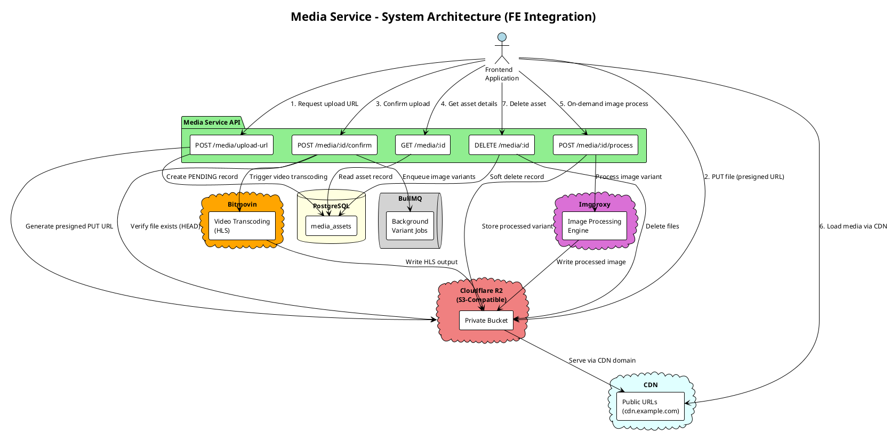
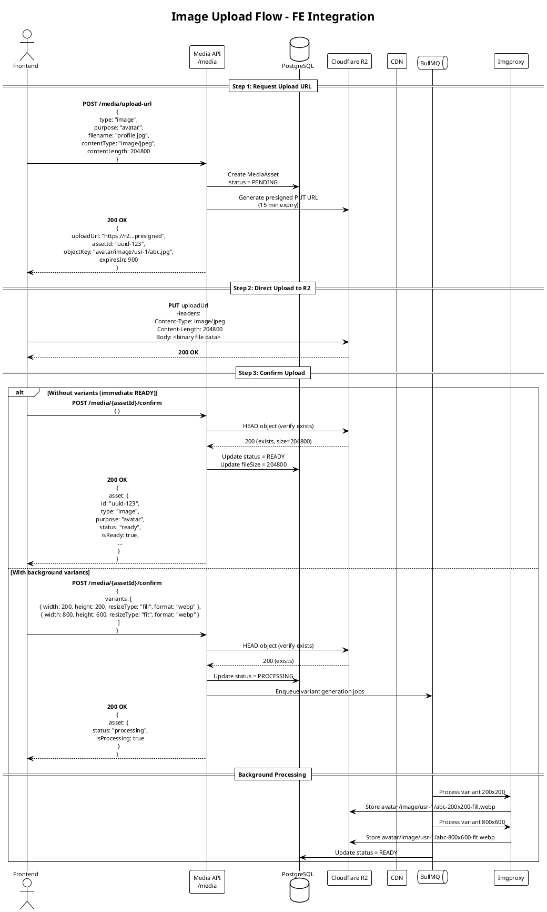
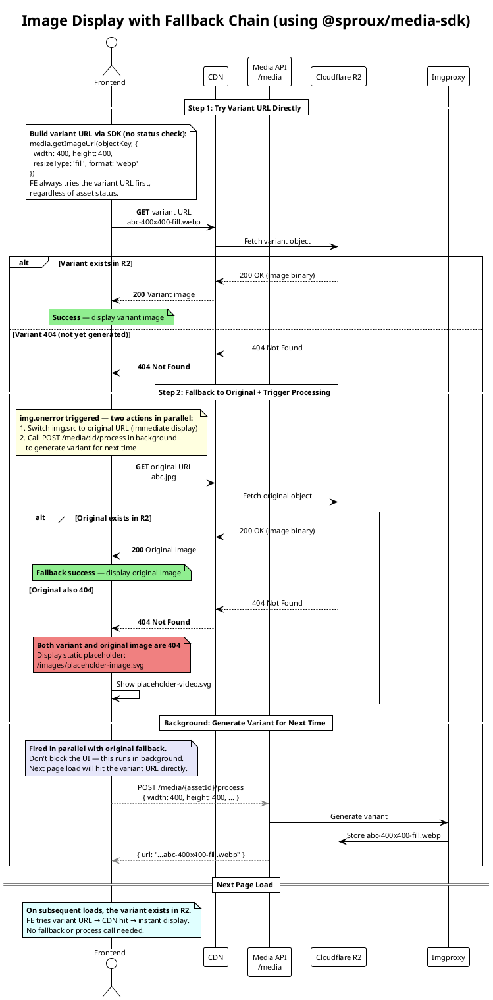
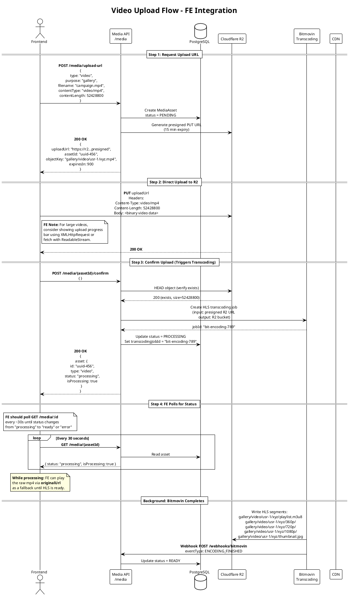
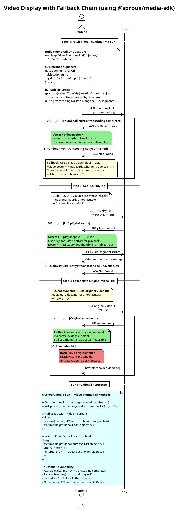
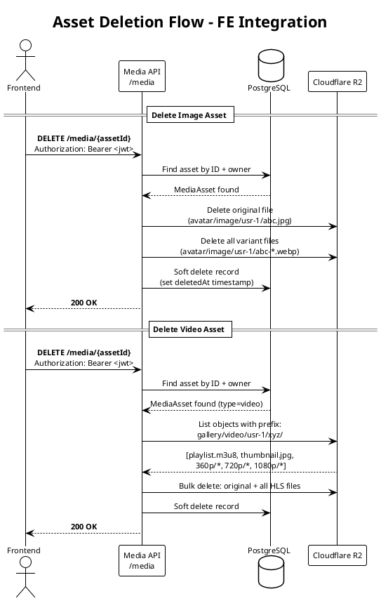

# Tech-Spec: Media Service - FE Integration Diagrams

**Created:** 2026-02-10
**Updated:** 2026-03-02
**Status:** Ready for Development

## Overview

### Problem Statement

FE developers need a clear, visual reference to understand how to integrate with the Media Service API — including upload flows, image processing, video transcoding, asset lifecycle, and all request/response contracts.

### Solution

A comprehensive set of PlantUML diagrams covering:

1. System architecture overview
2. Image upload flow (with optional background variants)
3. Video upload flow (with Bitmovin transcoding)
4. On-demand image processing flow
5. Asset deletion flow
6. Asset status state machine
7. R2 storage path structure
8. Complete API endpoint reference with DTOs
9. Complete integration flow overview
10. Error handling reference
11. **Image display fallback flow** (variant → original → placeholder)
12. **Video display fallback flow** (HLS → thumbnail → placeholder)
13. **SDK-based media display guide** (using `@sproux/media-sdk`)

### Scope

**In Scope:**

- All FE-facing API endpoints and their request/response contracts
- Sequence diagrams for every media operation
- Architecture diagram showing FE ↔ Backend ↔ External Services
- Asset lifecycle state machine
- R2 path structure reference

**Out of Scope:**

- Bitmovin webhook internals (server-to-server, not FE-facing)
- DLQ retry mechanics (internal infrastructure)
- Backend-only configuration details

---

## 1. System Architecture Overview

## 2. Image Upload Flow (Complete Sequence)

## 3. Image Display Fallback Flow

## 4. Video Upload Flow (with Bitmovin Transcoding)

## 5. Video Display Fallback Flow

## 6. Asset Deletion Flow

